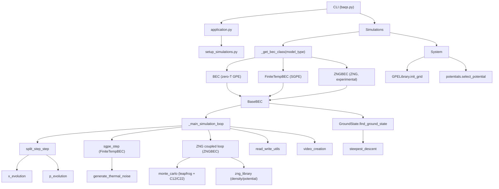

# GPE Acceleration — Comprehensive Documentation Source

> Use this file as a prompt to generate Astro/Starlight markdown pages.
> Each section below maps to one documentation page.

---

## PROJECT OVERVIEW

**Package name:** `baqs`  
**Version:** 0.1.0  
**Description:** A GPU-accelerated Python library for simulating Bose-Einstein Condensates (BECs) by solving the Gross-Pitaevskii Equation (GPE) using the Split-Step Fourier Method. Supports 2D and 3D simulations, imaginary-time ground-state finding, vortex/soliton imprinting, and automated multi-run orchestration.

**Python:** 3.7+  
**Key dependencies:** PyTorch 2.1.0+cu118, NumPy 1.23.5, Pandas 1.5.3, Matplotlib 3.7.1, OpenCV (cv2)

---

## PAGE 1 — Introduction / Getting Started

### What is baqs?
`baqs` (Bose-Einstein condensate Atomics Quantum Simulation) solves the time-dependent Gross-Pitaevskii equation for dilute ultracold quantum gases. It is GPU-native (PyTorch/CUDA) and is designed for research-grade simulations where performance and flexibility both matter.

### Installation
```bash
pip install -e .
# or
pip install -r requirements.txt
```

### Quick start
```bash
# Validate configuration file
baqs configuration_file.json appConfig.json --check

# Run all simulations defined in the config
baqs configuration_file.json appConfig.json --run
```

### Minimum working Python example
```python
from src.application import application
from src.models.simulation import Simulations

app = application()
app.initialise()

sims = Simulations(app)
sims.run_simulations()
```

---

## PAGE 2 — Core Concepts

### Gross-Pitaevskii Equation
The library solves:

```
i ħ ∂ψ/∂t = [ -ħ²∇²/2m + V_ext(r,t) + g|ψ|² ] ψ
```

where:
- `ψ(r,t)` is the macroscopic wavefunction (order parameter)
- `V_ext` is the external trapping potential
- `g = 4πħ²a_s/m` is the interaction strength
- `a_s` is the s-wave scattering length

An optional three-body loss term is supported:

```
i ħ ∂ψ/∂t = [ -ħ²∇²/2m + V_ext + g|ψ|² + i·k3·|ψ|⁴ ] ψ
```

### Split-Step Fourier Method
Each time step alternates real-space and momentum-space operations:

```
ψ(t+dt) = exp(-½i·dt·H_x) · exp(-i·dt·H_p) · exp(-½i·dt·H_x) · ψ(t)
```

- **Real-space operator** `H_x = g|ψ|² + V_ext` — applied pointwise
- **Momentum-space operator** `H_p = p²/2m` — applied after FFT, then iFFT back

The wavefunction is renormalized each step when computing ground states (imaginary-time mode).

### Imaginary Time Evolution (Ground State)
The ground state is found by evolving in imaginary time `τ = it`, which exponentially damps all excited states. The method used is steepest descent with adaptive step size, converging when the gradient norm falls below `1e-5`.

### Stochastic Projected GPE (SGPE) — Finite Temperature

Used by `FiniteTempBEC`. Extends the GPE to finite temperature by coupling the condensate to a thermal reservoir:

```
∂ψ/∂t = −(i + γ)(H_mf − μ)ψ + η(r, t)
```

- `H_mf = −∇²/2 + V_ext + u|ψ|²` — mean-field Hamiltonian
- `μ` — reservoir chemical potential (grand-canonical)
- `γ` — dimensionless damping rate; controls energy exchange with reservoir
- `η` — complex Gaussian noise satisfying the fluctuation-dissipation theorem:
  `⟨η*(r,t) η(r',t')⟩ = 2γ k_BT δ(r−r') δ(t−t')`

Modes with `H_mf > μ` are damped (energy removed to reservoir); modes with `H_mf < μ` are amplified (energy drawn from reservoir), driving the system toward thermal equilibrium at temperature `T`.  
Setting `γ > 0, T = 0` gives a purely dissipative (imaginary-time-like) damped GPE.

### Zaremba-Nikuni-Griffin (ZNG) Framework

Used by `ZNGBEC` (experimental). Full two-component finite-temperature description coupling a condensate GPE to a Monte Carlo classical thermal cloud.

**Condensate (modified GPE):**
```
i ∂ψ/∂t = [H_GP + i R(r,t)/2] ψ
H_GP = −∇²/2 + V_ext + u(n_c + 2ñ)
R(r) = 2 γ_12 [μ − V_eff(r)],   V_eff = V_ext + 2u(n_c + ñ)
```

**Thermal cloud (classical test particles):**
```
dr_i/dt = p_i
dp_i/dt = −∇U(r_i),   U = V_ext + 2u(n_c + ñ)
```

The two components are coupled via condensate density `n_c = |ψ|²` and thermal density `ñ(r)` deposited from test-particle positions (cloud-in-cell interpolation). C_12 stochastic collisions drive atom exchange between condensate and cloud.

### Units
All quantities are expressed in harmonic-oscillator units:
- Length: harmonic oscillator length `a_ho = sqrt(ħ / mω)`
- Energy: `ħω`
- Time: `1/ω`

---

## PAGE 3 — Configuration Reference

Simulations are driven by two JSON files.

### `appConfig.json` — Application configuration

| Key | Type | Description |
|-----|------|-------------|
| `device` | `"cpu"` \| `"cuda"` | Computation device |
| `logfile` | string | Path for simulation log |
| `appLogfile` | string | Path for application log |
| `configFile` | string | Default config file path |
| `write_velocity` | bool | Save velocity field snapshots |
| `phase_imaging` | bool | Save phase snapshots |

### `configuration_file.json` — Simulation physics parameters

#### Grid
| Key | Description |
|-----|-------------|
| `Grid_resolution` | `[dx, dy, dz]` — spatial step sizes |
| `Grid_negative_limits` | `[xmin, ymin, zmin]` |
| `Grid_positive_limits` | `[xmax, ymax, zmax]` |

#### Time evolution
| Key | Description |
|-----|-------------|
| `Total_simulation_time` | Total real-time duration |
| `dt` | Time step |
| `snapshots` | Number of output frames |

#### Trapping potential
| Key | Description |
|-----|-------------|
| `Potential_type` | `"harmonic"`, `"ramp"`, `"rotating"`, `"constant"`, `"ramp_harmonic"`, `"custom"` |
| `Trapping_frequencies` | `[ωx, ωy, ωz]` |
| `Potential_switch_off_time` | Optional: time at which potential is turned off |

#### Vortex excitations
| Key | Description |
|-----|-------------|
| `vortex_excitation` | `true` / `false` — enable imprinting |
| `vortex_charge` | List of winding numbers |
| `vortex_position_x` | List of x-positions |
| `vortex_position_y` | List of y-positions |
| `initial_imprint_time` | Time at which to first imprint |

#### Repetitive imprinting
| Key | Description |
|-----|-------------|
| `repetitive` | `true` / `false` |
| `imprint_every` | Time interval between imprints |
| `imprint_times` | List of scheduled imprint times |
| `max_imprints` | Maximum number of imprints |
| `imprinting_charge` | Charge for repetitive imprints |
| `imprint_position_x/y` | Position for repetitive imprints |

#### Dark solitons
| Key | Description |
|-----|-------------|
| `dark_soliton` | `true` / `false` |
| `soliton_position` | List of positions along soliton axis |
| `soliton_width` | List of healing-length widths |
| `soliton_axis` | Axis perpendicular to soliton plane |
| `soliton_greyness` | Greyness angle `α` (0 = black soliton) |

#### Complex Absorbing Potential (CAP)
| Key | Description |
|-----|-------------|
| `Absorber_enabled` | `true` / `false` |
| `Absorber_strength` | Imaginary amplitude |
| `Absorber_start_ratio` | Fraction of box where absorption starts (default 0.8) |
| `Absorber_power` | Polynomial exponent of the profile (default 2.0) |
| `Absorber_tinit` | Time at which absorber begins ramping up |
| `Absorber_tfinal` | Time at which absorber reaches full strength |

#### Three-body loss
| Key | Description |
|-----|-------------|
| `three_body_loss` | `true` / `false` |
| `k3` | Three-body loss coefficient |

#### Model selection
| Key | Description |
|-----|-------------|
| `model_type` | `"BEC"` (default) — zero-temperature GPE; `"FiniteTempBEC"` — SGPE; `"ZNGBEC"` — ZNG two-component (experimental) |

#### SGPE / Finite-temperature parameters (used when `model_type = "FiniteTempBEC"`)
| Key | Default | Description |
|-----|---------|-------------|
| `temperature` | `0.0` | Dimensionless temperature `k_B T / (ħ ω_ho)`. Set to `0` for damped GPE (no noise, pure dissipation). |
| `damping_coefficient` | `0.03` | Damping rate γ. Controls energy exchange strength with the reservoir. γ=0 → standard GPE. |
| `chemical_potential` | `null` | Reservoir chemical potential μ. If null, computed once from the initial ground state as `μ = e_kin + e_pot + 2·e_int`. |

#### ZNG parameters (used when `model_type = "ZNGBEC"`)
| Key | Default | Description |
|-----|---------|-------------|
| `temperature` | — | Dimensionless temperature `k_B T / (ħ ω_ho)`. Must be > 0. |
| `n_test_particles` | `10000` | Number of Monte Carlo test particles representing the thermal cloud. Larger = smoother `ñ`, more compute. |
| `gamma_12` | `0.1` | C_12 coupling rate between condensate and thermal cloud. γ_12=0 fully decouples them. |
| `chemical_potential` | `null` | Reservoir μ. If null, computed from the ground state. |
| `enable_c22` | `false` | Enable C_22 thermal–thermal collisions (currently a no-op stub). |

#### Multi-simulation sweeps
Any parameter can be passed as a list to automatically generate a simulation for each value. `get_simulation_combinations()` builds the Cartesian product of all list-valued parameters.

---

## PAGE 4 — API Reference: Physics Library (`src/library/`)

### `gpe_library.GPELibrary`

Base class exposing the core numerical operators. All methods accept and return PyTorch tensors.

#### `init_grid(x_min, x_max, dx, dp, w, n1, n2, n3, device) -> tuple`
Create spatial and momentum grids.  
Returns `(x1, x2, x3, p1, p2, p3, p_sq, space_grid, p_grid)` where each `xi` and `pi` are 1-D tensors, `p_sq` is the 3-D squared-momentum operator, `space_grid` is a 3-tuple of 3-D real-space meshgrids, and `p_grid` is a 3-tuple of 3-D momentum meshgrids.

#### `x_evolution(psi, utot, dtau, factor=0.5) -> Tensor`
Apply the real-space half-step: `ψ ← ψ · exp(-factor · i · dtau · utot)`.

#### `p_evolution(psi, dtau, p_sq) -> Tensor`
Apply the full momentum-space step via FFT: `ψ ← IFFT( FFT(ψ) · exp(-i · dtau · p_sq/2) )`.

#### `normalize(phi, d_x) -> Tensor`
Normalize the wavefunction so `∫|ψ|² dV = 1`.

#### `split_step_step(psi, utot, dtau, p_sq, d_x) -> Tensor`
Execute one full Trotter-factorized split-step iteration (half-x, full-p, half-x, normalize).

#### `extract_phase(psi) -> Tensor`
Return `angle(ψ)` — the complex phase field.

#### `update_phase(psi, phase) -> Tensor`
Return `|ψ| · exp(i · phase)`.

#### `mod_grad_psi(psi, p_axes) -> Tensor`
Compute `|∇ψ|` spectrally, used in energy calculations.

#### `calculate_energy_allocation(psi, Vext, p_grid, **params) -> dict`
Return a dict with keys `kinetic`, `potential`, `interaction` (and `three_body` if enabled) as scalar tensors.

#### `calculate_density_peak(psi) -> tuple`
Return `(peak_density, (i, j, k))` — maximum of `|ψ|²` and its 3-D grid indices.

#### `calculate_chemical_potential(psi, uext, u, p_grid, d_x) -> float`
Compute the mean-field chemical potential `μ = ⟨ψ|H_mf|ψ⟩ = e_kin + e_pot + 2·e_int`.  
Used by `FiniteTempBEC` and `ZNGBEC` to fix the grand-canonical reservoir potential when not supplied in config.

#### `generate_thermal_noise(shape, gamma, kT, dtau, d_x, device) -> Tensor`
Generate a complex Gaussian noise field for one SGPE time step satisfying the fluctuation-dissipation theorem.  
Noise amplitude: `σ = √(γ · kT · dtau / d_x)`.  
Only used when `temperature > 0`.

#### `sgpe_step(psi, utot, mu, gamma, dtau, p_sq, d_x) -> Tensor`
Perform one deterministic SGPE split-step with `(1 − iγ)` damping.  
Replaces the standard unitary GPE propagator with a dissipative one:
```
exp(−(i+γ) · dt · (H_mf − μ))
```
Split-step sequence: real-space half-step → momentum full-step → real-space half-step → normalize.  
Modes above μ are damped; modes below μ are amplified.

---

### `gpe_library.GPE2DLibrary(GPELibrary)`

2D-specific extensions. All position arguments refer to the two simulation axes (x1, x3 by convention).

#### `create_vortices(vortices, x1, x2, x3, n1, n2, n3, device) -> Tensor`
Build a vortex phase field.  
`vortices` is a dict with keys `position_x`, `position_y`, `charge` (lists of equal length).  
Returns a (n1, n2, n3) phase tensor.

#### `calculate_velocity2D(phase2D, p_grid) -> tuple`
Compute the superfluid velocity field from the 2D phase via spectral differentiation.  
Returns `(speed, angle)` — both (n1, n3) tensors.

#### `rms_radius(psi, center, space_grid) -> Tensor`
Compute the root-mean-square radius of the density distribution relative to `center`.

#### `create_dark_soliton(x1, x3, n1, n2, n3, positions, widths, axes, greyness, device) -> Tensor`
Create a soliton mask: `f(r) = cos(α)·tanh(cos(α)·(r-r0)/w) + i·sin(α)`.  
`greyness=0` → black soliton (full density notch + π phase jump).

#### `imprint_dark_soliton(psi, soliton_mask) -> Tensor`
Return `ψ · f(r)`.

#### `calculate_cross_section_line(psi, axis) -> Tensor`
Integrate `|ψ|²` perpendicular to `axis`, returning a 1-D density profile.

#### `repetitive_imprint(psi, repetitive_phase) -> Tensor`
Multiply the current phase of `ψ` by the pre-computed `repetitive_phase`.

---

### `gpe_library.GPE3DLibrary(GPELibrary)`

3D-specific extensions.

#### `create_vortex_ring(x1, x2, x3, n1, n2, n3, ring_radius, center, axis, charge, device) -> Tensor`
Generate the phase pattern of a circular vortex ring of given radius and charge.

#### `create_vortex_lines(x1, x2, x3, n1, n2, n3, positions, charges, axis, device) -> Tensor`
Generate phase patterns for multiple straight vortex lines parallel to `axis`.

#### `column_density(psi, axis) -> Tensor`
Integrate `|ψ|²` along the given axis, returning a 2-D projected density.

#### `cross_section_plane(psi, axis, index) -> Tensor`
Return a 2-D slice of `|ψ|²` orthogonal to `axis` at grid index `index`.

#### `calculate_velocity3D(psi, p_grid) -> tuple`
Compute the 3-D superfluid velocity `v_i = Im(ψ* ∂_i ψ) / |ψ|²` spectrally.  
Returns `(speed, angle)` — both 3-D tensors.

#### `angular_momentum(psi, space_grid, p_grid, component) -> Tensor`
Compute `⟨L_component⟩` where `component` ∈ {1, 2, 3} or {'x','y','z'}.

---

### `equations.py`

Defines the right-hand-side operators applied during time evolution.

#### `GPE_base`
Standard GPE: `space_operator = g|ψ|² + V_ext`

#### `GPE_3body_loss`
Adds imaginary three-body loss: `space_operator = g|ψ|² + V_ext + i·k3·|ψ|⁴`

#### `CustomEquation`
Wraps a user-supplied callable `operator(psi, **kwargs)` so it conforms to the `Equation` interface.

---

### `ground_state.GroundState`

#### `find_ground_state(sim_params, system, file_name, device) -> Tensor`
Find the ground-state wavefunction.  
- If a saved file exists at `file_name`, loads it.  
- Otherwise runs imaginary-time steepest descent to convergence (`|gradient| < 1e-5` or negligible energy change).  
Returns the normalized ground-state wavefunction as a complex tensor.

#### `steepest_descent(psi, dtau, p_sq, uext, d_x, u) -> tuple`
Single imaginary-time step.  
Returns `(psi_new, energy, tolerance, chemical_potential)`.

#### `read_ground_state(data, n1, n2, n3) -> Tensor`
Reconstruct a complex wavefunction tensor from saved CSV data.

---

### `potentials.py`

All potential classes inherit from `Potential`.

#### Common interface
- `evol(t) -> Tensor` — return potential grid at time `t`
- `zero() -> Tensor` — set potential to zero (used for switch-off)
- `_configure_absorber(**kwargs)` — set up Complex Absorbing Potential region

#### `ConstPot`
Uniform potential. `evol(t)` returns a constant tensor.

#### `HarmonicPot`
`V = 0.5 · amplitude · (ωx²·x² + ωy²·y² + ωz²·z²)`  
`zero_2D(amplitude)` projects a 3D trap onto one radial axis.

#### `RampPot`
Linear time ramp: `V(t) = V_initial + (V_final - V_initial) · (t / t_final)`

#### `RampHarmonicPot`
Harmonic trap whose frequency amplitude evolves linearly in time.

#### `RotatingPot`
Harmonic potential in a co-rotating frame.  
At time `t`, the potential grid is computed in coordinates rotated by `θ = ω_rot · t`.  
Constructor requires `axis` (rotation axis, 1/2/3 or x/y/z) and `omega_rotation`.

#### `CustomPot`
Template for user-defined potentials. Override `evol(t)` to return an arbitrary (n1, n2, n3) tensor.

---

### `parameters.CONSTANTS`

Physical constants used throughout the library.

| Attribute | Value / Description |
|-----------|---------------------|
| `pi` | π |
| `hbar` | Reduced Planck constant (J·s) |
| `amu` | Atomic mass unit (kg) |
| `a_bohr` | Bohr radius (m) |
| `m1` | Mass of Rb-87 |
| `m2` | Mass of Ca-41 |
| `mass_ratio` | m1 / m2 |
| `ascat` | s-wave scattering length |
| `nat` | Number of atoms |
| `k3` | Three-body loss coefficient |

---

## PAGE 5 — API Reference: Models (`src/models/`)

### `system.System`

Encapsulates the simulation grid, potential, and parameter set.

#### Constructor
```python
System(app: application)
```
Reads `app.configFile` and `app.device`, then calls `_initialise_parameters()` and `_initialise_grid()`.

#### Key attributes
| Attribute | Description |
|-----------|-------------|
| `device` | `torch.device` |
| `space_axes` | `(x1, x2, x3)` — 1-D real-space grids |
| `momentum_axes` | `(p1, p2, p3)` — 1-D momentum grids |
| `p_sq` | 3-D squared-momentum operator |
| `p_grid` | 3-D momentum meshgrids |
| `space_grid` | 3-D real-space meshgrids |
| `center` | Grid center coordinates |
| `simulation_parameters` | Flat dict of all config values |
| `uext` | External potential object (`Potential` subclass) |

---

### `base_BEC.BaseBEC`

Concrete base class providing all common BEC simulation infrastructure. Subclass this when you need custom physics, measurements, or output.

#### Constructor
```python
BaseBEC(parameters: dict, system: System, app: application, simulation_name: str)
```

#### `evolve()`
Entry point for a full simulation run. Calls in order:
1. `_initialize_simulation_parameters()` — extract params from system into instance variables
2. `_initialise()` — load ground state, set `self.psi`
3. `_main_simulation_loop()` — time-step loop
4. `_write_simulation_outputs()` — flush results

#### Infrastructure methods (use directly in subclasses)

| Method | Description |
|--------|-------------|
| `_find_ground_state()` | Locate or compute ground-state file; sets `self.gs_path` |
| `_initialise()` | Read ground-state file into `self.psi` |
| `_step(utot, dtau, p_sq, d_x)` | One split-step Fourier iteration; updates `self.psi` |
| `_extract_phase()` | Return `angle(ψ)` |
| `get_density()` | Return `|ψ|²` |
| `_get_snapshot_interval()` | Return iteration stride for snapshots; `None` when `shots ≤ 0` |

#### Template methods to override

| Method | Purpose |
|--------|---------|
| `_initialize_custom_parameters()` | Parse extra config keys; called at end of `_initialize_simulation_parameters()` |
| `_main_simulation_loop()` | Implement custom time evolution (default: basic GPE loop) |
| `_write_iteration_data(count, t)` | Per-snapshot output; default writes density, phase, RMS, energy |
| `_write_simulation_outputs()` | End-of-simulation output; default writes RMS/energy CSV + videos |
| `_write_custom_outputs()` | Hook called inside `_write_simulation_outputs()`; default no-op |

#### Key instance variables (set by `_initialize_simulation_parameters()`)

| Variable | Description |
|----------|-------------|
| `psi` | `Tensor (n1,n2,n3) cdouble` — current wavefunction |
| `kmax` | Total number of time iterations |
| `dt`, `dtau`, `omega_ho` | Time step parameters |
| `shots` | Number of snapshot frames |
| `d_x`, `a_ho` | Grid cell volume and harmonic length |
| `p_sq`, `p_grid` | Momentum-space operators |
| `x1, x2, x3`, `p1, p2, p3` | 1-D axes |
| `n1, n2, n3` | Grid point counts |
| `uext` | External potential tensor (current time step) |
| `u` | Interaction strength |
| `rms_measurements` | `dict` — snapshot index → RMS radius |
| `cross_line` | `Tensor (shots, n1)` — 1-D density profiles |
| `energies` | `list` — energy dicts at each snapshot |

---

### `BEC.BEC`

Full zero-temperature GPE simulation with vortex imprinting, dark solitons, three-body loss, and repetitive imprinting. Inherits from `BaseBEC`.

#### Constructor
```python
BEC(parameters: dict, system: System, app: application, simulation_name: str)
```

#### `evolve()`
Entry point for a full simulation. Sequence:
1. `_initialize_simulation_parameters()` — including vortex/soliton sub-init
2. `_initialise()` — load ground state
3. (optional) `_calculate_all_phases()` — pre-compute repetitive imprint phases
4. `_main_simulation_loop()` — time-step loop with imprinting and potential switch-off
5. `_write_simulation_outputs()` — flush results

#### Sub-initialization methods

| Method | Description |
|--------|-------------|
| `_initialize_vortex_parameters()` | Parse vortex config; build `imprinting_vortices_dictionary` |
| `_initialize_dark_soliton_parameters()` | Parse soliton config |

#### Key internal methods

| Method | Description |
|--------|-------------|
| `_create_vortices(vortices)` | Compute vortex phase tensor from position/charge array |
| `_imprint_vortices(vortices)` | Multiply ψ by vortex phase |
| `_create_vortex_list(...)` | Build time-keyed vortex schedule dict |
| `_calculate_all_phases(imprinting_vortices)` | Pre-compute phases for every scheduled imprint |
| `_perform_initial_imprint()` | Imprint vortices at `initial_imprint_time` |
| `_perform_repetitive_imprint(num_imprints)` | Apply pre-computed phase at scheduled time |
| `_imprint_dark_solitons()` | Apply soliton mask to ψ |
| `_turn_off_potential()` | Zero external potential at switch-off time |
| `_log_repetitive_imprint_info(shots_per_ms)` | Log imprint schedule |

#### Dark soliton configuration keys (note renamed keys vs older API)

| Config key | Description |
|------------|-------------|
| `soliton_positions` | List of soliton centre positions |
| `soliton_widths` | List of characteristic widths |
| `soliton_axes` | List of axes (1=x, 3=z) each soliton is perpendicular to |
| `soliton_greyness` | Optional list of grey-soliton angles α (radians) |
| `soliton_imprint_time` | Snapshot index at which soliton is imprinted (default 0) |

#### Key attributes

| Attribute | Type | Description |
|-----------|------|-------------|
| `repetitive_phase` | Tensor | Pre-computed phase for repetitive imprinting |
| `all_phases` | dict | `(x, y, charge)` tuple → phase tensor |
| `reset_potential` | bool | True after `_turn_off_potential()` to prevent re-zeroing |

---

### `finite_temp_BEC.FiniteTempBEC`

Finite-temperature BEC simulation using the Stochastic Projected GPE (SGPE). Inherits from `BaseBEC`; only `_initialize_custom_parameters()` and `_main_simulation_loop()` are overridden.

#### Constructor
Same signature as `BaseBEC`: `(parameters, system, app, simulation_name)`.

#### `_initialize_custom_parameters()`
Reads SGPE-specific config keys: `temperature`, `damping_coefficient`, `chemical_potential`.

#### `_main_simulation_loop()`
SGPE loop. Each iteration:
1. **SGPE deterministic step** — `gpe.sgpe_step()` with `(1−iγ)` damping
2. **Stochastic noise injection** — `gpe.generate_thermal_noise()` (only when `T > 0`)
3. **Renormalization** — enforces grand-canonical particle-number constraint
4. **Potential update** — calls `system.uext.evol(t)` if supported

Chemical potential μ is computed once from the ground state at the first iteration if not supplied in config.

---

### `experimental.zng.zng_BEC.ZNGBEC`

Full Zaremba-Nikuni-Griffin (ZNG) two-component finite-temperature simulation. Inherits from `BaseBEC`. Overrides `_initialize_custom_parameters()`, `_initialise()`, and `_main_simulation_loop()`.

> **Status:** Experimental. In `src/experimental/zng/`.

#### State

| Attribute | Description |
|-----------|-------------|
| `psi` | Condensate wavefunction ψ(r), shape `(n1,n2,n3)` |
| `particle_positions` | Thermal test-particle positions, shape `(N_test, 3)` |
| `particle_momenta` | Thermal test-particle momenta, shape `(N_test, 3)` |
| `n_tilde` | Thermal density ñ(r) on the grid, shape `(n1,n2,n3)` |

#### `_main_simulation_loop()`
ZNG coupled evolution. Each iteration:
1. Condensate density `n_c = |ψ|²`
2. Condensate GPE potential: `V_GP = V_ext + u(n_c + 2ñ)`
3. Source term: `R = 2 γ_12 [μ − V_eff]`
4. Condensate split-step with complex potential `V_GP + i·R/2`
5. Thermal particle potential: `U = V_ext + 2u(n_c_new + ñ)`
6. Leapfrog advance of test particles under `U`
7. C_12 stochastic collisions (condensate ↔ thermal exchange)
8. C_22 thermal–thermal collisions (stub, enabled via `enable_c22`)
9. Update ñ from new particle positions (cloud-in-cell)

#### ZNG helper modules

| Module | Key functions |
|--------|--------------|
| `zng_library.py` | `thermal_density_from_particles`, `mean_field_potential_for_thermal`, `condensate_gpe_potential`, `condensate_source_term`, `sample_initial_thermal_cloud` |
| `monte_carlo.py` | `advance_particles_leapfrog`, `apply_c12_collisions`, `apply_c22_collisions` |

---

### `simulation.Simulations`

Runs multiple BEC instances, one per configuration combination. Selects the correct model class via `model_type`.

```python
Simulations(system: System, app: application)
sims.run_simulations()
```

#### `_get_bec_class(model_type) -> type`
Factory function that maps `model_type` string to the corresponding class:
- `"BEC"` → `src.models.BEC.BEC`
- `"FiniteTempBEC"` → `src.models.finite_temp_BEC.FiniteTempBEC`
- `"ZNGBEC"` → `src.experimental.zng.zng_BEC.ZNGBEC`

Imports are deferred so the experimental ZNG module is only loaded when explicitly requested.

For each combination produced by `get_simulation_combinations()`:
1. Creates a subdirectory named after the combination
2. Calls `_get_bec_class(parameters.get("model_type", "BEC"))` to select model
3. Instantiates the model and calls `bec.evolve()`
4. Logs progress; frees GPU memory with `torch.cuda.empty_cache()`

---

## PAGE 6 — API Reference: Utilities (`src/utils/`)

### `setup_simulations.py`

#### `get_simulation_parameters(config_file) -> tuple`
Load and validate the simulation config.  
Returns `(combinations_list, raw_params_dict)` where `combinations_list` is a list of `(folder_name, params_dict)` pairs.

#### `get_simulation_combinations(sims) -> list`
Build the Cartesian product of all list-valued parameters.  
Single-valued parameters are broadcast to all combinations.

#### `_check_simulation_parameters(params) -> tuple`
Validate that all required keys are present and have sensible types/ranges.  
Returns `(is_valid: bool, error_messages: list)`.

#### `save_parameters_to_json(params)`
Write the active parameter dict to `parameters.json` inside the simulation output directory.

---

### `read_write_utils.py`

All I/O functions that write data use row-major (C-order) NumPy dumps compatible with standard analysis tools.

| Function | Description |
|----------|-------------|
| `write_psi(file_name, psi, n1, n2, n3)` | Serialize full complex wavefunction |
| `write_data(psi, count, x1, x3, ...)` | Write column-density snapshot (`R-###-cd.dat`) |
| `write_phase(phase, count, ...)` | Write 3-D phase field |
| `write_phase2D(phase, count, ...)` | Write 2-D phase field |
| `read_phase_file_2D(filename, n1, n3)` | Load 2-D phase tensor from file |
| `write_velocity2D(phase, count, ...)` | Velocity field snapshot |
| `write_rms(rms_meas, SimulationName)` | RMS radius time series → CSV |
| `write_energy_terms(energies, filename)` | Energy breakdown → CSV |
| `save_figure_phase(phase, frame)` | Phase field → PNG |
| `save_rms_figure(title)` | RMS evolution → PNG |
| `save_cross_section_line_figure(data)` | 3-D density evolution → PNG |
| `save_tensor_to_csv(tensor, filename)` | Arbitrary tensor → CSV |

---

### `video_creation.py`

#### `create_video(count, simulation_name, n1, n3)`
Assemble density snapshots (`R-###-cd.dat`) into an MP4 at 10 fps.

#### `create_velocity_video(count, simulation_name, n1, n3)`
Assemble velocity-field snapshots into an MP4 at 10 fps.

---

## PAGE 7 — CLI Reference

### Command
```bash
baqs <config_file> <app_config_file> [options]
```

### Options
| Flag | Description |
|------|-------------|
| `--check` / `-c` | Validate the config file without running |
| `--run` | Execute all simulations |
| `--verbose` / `-v` | Increase console log verbosity |

### Examples
```bash
# Validate only
baqs configuration_file.json appConfig.json --check

# Run with verbose output
baqs configuration_file.json appConfig.json --run --verbose

# Validate and run
baqs configuration_file.json appConfig.json --check --run
```

---

## PAGE 8 — Extending the Library

### Custom potential
```python
from src.library.potentials import Potential

class MyPot(Potential):
    def evol(self, t):
        # return a (n1, n2, n3) torch.Tensor
        return self.base_potential + t * self.ramp_coeff
```
Register by adding `"my_pot"` to the `select_potential` dispatch in `potentials.py`.

### Custom equation
```python
from src.library.equations import CustomEquation

def my_operator(psi, **kwargs):
    return kwargs['g'] * psi.abs()**2 + kwargs['V']

eq = CustomEquation(my_operator)
```

### Custom BEC simulation
```python
from src.models.base_BEC import BaseBEC

class MyBEC(BaseBEC):
    def _initialize_custom_parameters(self):
        self.my_param = self.system.simulation_parameters['my_param']

    def _main_simulation_loop(self):
        for step in range(self.n_steps):
            utot = self.system.uext.evol(self.t)
            self.psi = self._step(utot, self.dt, self.p_sq, self.dx)
            self.t += self.dt
            if step % self.snapshot_interval == 0:
                self._write_iteration_data(step, self.t)

    def _write_simulation_outputs(self):
        # save custom results
        pass
```

---

## PAGE 9 — Output Files Reference

For each simulation, outputs are written to a subdirectory named after the parameter combination.

| File pattern | Content |
|-------------|---------|
| `R-###-cd.dat` | Column density snapshot at step ### |
| `phase-###.dat` | Phase field snapshot at step ### |
| `velocity-###.dat` | Velocity field snapshot at step ### |
| `phase-###.png` | Phase field image |
| `rms.csv` | RMS radius vs simulation time |
| `rms.png` | RMS radius plot |
| `energy.csv` | Kinetic / potential / interaction energy vs time |
| `cross_section.png` | 1-D density evolution (space × time) |
| `simulation.mp4` | Video assembled from density snapshots |
| `velocity.mp4` | Video assembled from velocity snapshots |
| `parameters.json` | Copy of active simulation parameters |
| `ground_state.csv` | Ground-state wavefunction (if computed) |

---

## PAGE 10 — Architecture Diagram (for Mermaid rendering in Astro)



---

## ASTRO GENERATION INSTRUCTIONS

When generating Astro/Starlight markdown files from this document, follow these rules:

1. **One MDX file per PAGE** numbered above. Suggested filenames:
   - `src/content/docs/getting-started.mdx`
   - `src/content/docs/concepts/gpe.mdx`
   - `src/content/docs/configuration.mdx`
   - `src/content/docs/api/physics-library.mdx`
   - `src/content/docs/api/models.mdx`
   - `src/content/docs/api/finite-temperature.mdx`  ← NEW (FiniteTempBEC + ZNGBEC)
   - `src/content/docs/api/utilities.mdx`
   - `src/content/docs/cli.mdx`
   - `src/content/docs/guides/extending.mdx`
   - `src/content/docs/reference/output-files.mdx`
   - `src/content/docs/reference/architecture.mdx`

2. **Frontmatter** for each file:
   ```yaml
   ---
   title: <page title>
   description: <one-line description>
   sidebar:
     order: <page number>
   ---
   ```

3. Use `##` for top-level sections, `###` for subsections, `####` for individual items.

4. Wrap all code examples in fenced code blocks with the correct language tag (`python`, `bash`, `json`, `mermaid`).

5. Use `:::note`, `:::tip`, `:::caution` Starlight asides where appropriate.

6. Keep table formatting as-is (Starlight renders standard Markdown tables).

7. For the architecture page, render the Mermaid block directly — Starlight supports it natively.
