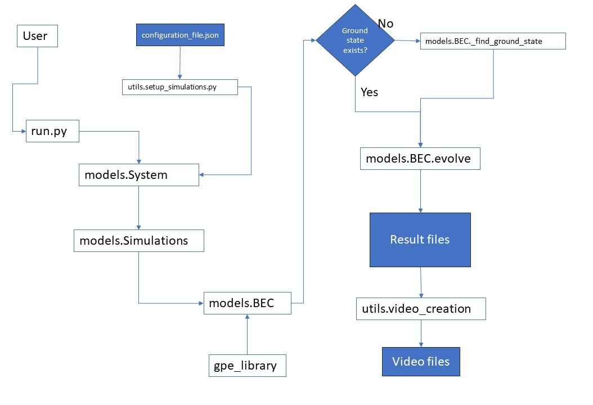

# GPE_acceleration
GPU accelerated code for the implementation of a GPE solver.
This package contains a simple Python implementation that accelerates the usual GPE split-step Fourier solution utilising GPUs and the PyTorch software package.

The software simulates the evolution of a BEC when a topological excitation is imprinted in the condensate.
Currently the only topological excitation supported is vortices. The vortices can either be in a linear array or isolated.
A repetitive imprinting functionality is supported.

The vortices are assumed to be printed on the n1-n3 (i.e. x-z plane). For the simulations to have physical meaning, it is assumed that the BEC is adequately flat on the n2 (y axis) so that the vortices are assumed to not bend and traverse the whole BEC along the y axis.

## Run
To run the code, you simply run the `run.py` script. This script invokes any necessary function and set-up of the simulation.

The simulations are defined in a json file called 'configuration_file.json'.

**Important** -- Each configuration file is strictly for one grid and potential configuration. Multiple simulations can be run in sequence but all have to be on the same grid and potential with the same ground state.

First the ground state for the specific grid is calculated (if it doesn't already exist). Then every simulation is run one after another and the results are stored in their respective folders.

The flow of the logic is as follows:

## Dependencies
the main package dependencies are:
- numpy:  1.23.5
- pandas:  1.5.3
- torch:  1.8.1
- matplotlib:  3.7.1

The software should run for Python version >=3.7

## API Reference

### `run.py`
This is the entry point to the software and the simulations. This script is called and accepts all the necessary inputs (see configuration_file). Then everything runs in an automated fashion.

### `library.ground_state`
The ground state is calculated numerically using the imaginary time method.

For the ground state calculations, pyTorch 1.8.1 has been tested.
With later versions, when doing the conjugations of matrices, the functions might have changed.
Specifically, in later versions the `torch.conj()` performs a lazy conjugation and has to be realised
in a tensor separately. In PyTorch version 1.8.1, the one currently used it is calculated directly.
The rest of the used functions should be the same.

### `library.gpe_library`
Provides all the necessary functions to run the simulations, load/write the data, imprint the vortices and the split-step Fourier methods.

### `library.gpe_evolution`
Provides the functions that run the main loop of the simulations. Simulation parameters are needed as inputs.

### `utils.setup_simulations`
This script is responsible for reading the configuration file, performing checks on the validity of its contents and creating the simulation parameters for each simulation that will be run.

### `utils.video_creation`
Provides the utility functions to create the video from the snapshot data files

### configuration_file
One configuration file is needed for each grid and/or potential configuration. Multiple simulations can be run using this configuration file.
 
 **Important** : Currently only one configuration file can exist in a working directory. If different grids need to be run at the same time, then more python processes are needed that will run in different directories (i.e. copy the code in different folders and run it there)

 The configuration file can be built for either an array of vortices or vortices that will be repetitively imprinted.

 Checks on the inputs of the configuration file will be performed before setting up the simulations.

 # HOW TO CREATE THE CONFIGURATION FILE
 **Important** -- Each configuration file is strictly for one grid and potential configuration. Multiple simulations can be run in sequence but all have to be on the same grid and potential with the same ground state.

- "Grid_positive_limits": These are the 3D grid axes in microns e.g. [60, 1.5, 60],
- "Grid_negative_limits": Usually the grid is symmetric and the potential is considered centered e.g. [-60, -1.5, -60],
- "Grid_resolution": This is the number of points along each one of the axes e.g.[512, 16, 512] for a flat BEC,
- "Trapping_frequencies": These are the frequencies in Hz [20, 300, 20],
- "Potential_type":e.g. "harmonic" For a full list see below,
- "Total_simulation_time":150e-3, in sec,
- "dt":5e-7, the time resolution of the simulation in sec,
- "snapshots":150, the number of snapshot data to be generated. Each file can be several Mb. For more intuitive results set it the same as the total time so that each snapshot is 1ms,
- "vortex_excitation":1, This is used as a boolean that indicates the topological excitation we are simulating,
- "repetitive":1, Indicates that repetitive imprinting is used,

For the rest it is expected that the lists contain as many elements as the simulations we want to run. Each element of the list (could be a list itself) is a separate configuration
- "vortex_charge":[2, 5], List of initial charges,
- "imprinting_charge":[1, 3],
- "vortex_position_x":[0, 0],
- "vortex_position_y":[0, 0],
- "imprint_position_x":[0, 0],
- "imprint_position_y":[0, 0],
- "imprint_every":[20, 50],
- "imprint_times":[[10,20,50], []],
- "max_imprints":[3, 2]

The above configuration would give 2 simulations.

**NOTE: When we give "imprint_times", those override the "imprint_every" parameter. We need to give an empty list for the "imprint_times" if we want them to be automatically calculated based on the "imprint_every" parameter**

_First simulation_:

We start with an initial vortex of charge 2 at position (0,0). We then want to imprint a vortex of charge 1 at position (0,0). Because we give exact times to imprint, this overrides the "imprint_every" parameter which is 20, and the imprints will happen at the exact times 10, 20 and 50. Also note that the "max_imprints" are 3 for this simulation so all the imprints will happen.

_Second simulation_:

We start with an initial vortex of charge 5 at position (0,0). We then imprint a vortex of charge 3 at position (0,0). Now we don't give exact times to imprint, so the "imprint_every" value of 50 will create the times. The imprints times will be 50, 100, 150. However, because the "max_imprints" are 2, only the imprints at times 50 and 100 will occur. Note that even that we give an "imprint_every" value, we have to give an empty list for the "imprint_times" otherwise an error will be raised. The software needs to be able to align the inputs at the same length.

List of available potentials:
- **harmonic** , a harmonic potential with 3 trapping frequencies
- **constant**, a constant potential across the whole grid
- **ramp**, potential that ramps up from an initial to a final amplitude in a linear fashion
- **rampharmonic**, harmonic potential whose amplitude ramps up linearly in time